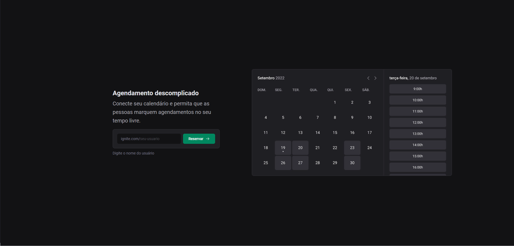

 # Ignite call
🚧

 🚧A aplicação está com um erro ao selecionar o horário devido a timezone, portanto está selecionando para 3 horas a frente, irei consertar em breve 🚧

  

  ---
  
 
 
This is a full stack project with Nextjs and integration with Google calendar developed for study and learning purposes during <a href="https://www.rocketseat.com.br/">Rocketseat's</a> ignite course on the ReactJS specialization track

 
 ---
  
 
Trata-se de um projeto full stack com Nextjs e integração com google calendar desenvolvido para fins de estudo e aprendizado durante o curso ignite da <a href="https://www.rocketseat.com.br/">Rocketseat</a> na trilha de especializção ReactJS

## Topics
- [Ignite call](#ignite-call)
  - [Topics](#topics)
  - [About](#about)
  - [Table of contents](#table-of-contents)
  - [Instructions for use](#instructions-for-use)
    - [Prerequisites](#prerequisites)
    - [How to use](#how-to-use)
  - [Technologies](#technologies)

## About 

Trata-se de um projeto full stack com Nextjs e integração com google calendar desenvolvido para fins de estudo e aprendizado durante o curso ignite da <a href="https://www.rocketseat.com.br/">Rocketseat</a> na trilha de especializção ReactJS

## Table of contents
<table>
  <thead>
    <tr>
      <th>Fases / Steps</th>
      <th>Ferramentas / Tools</th>
    </tr>
  </thead>
  <tbody>
    <tr>
      <td>Criando Estrutura / Assembling structure</td>
      <td>Typescript, NextJS, Design System</td>
    </tr>
    <tr>
      <td>Cadastro de usuário / User registration</td>
      <td>Zod, React Hook Form, Prisma, API Routes</td>
    </tr>
    <tr>
      <td>Integração com o Google / Integration with Google</td>
      <td>oAuth, NextAuth, Adapter</td>
    </tr>
    <tr>
      <td>Disponibilidade e perfomance / Availability and performance</td>
      <td>React query, Refresh Token </td>
    </tr>
    <tr>
      <td>Banco de dados / Database</td>
      <td>Mysql</td>
    </tr>
  </tbody>
</table>

## Instructions for use
  
  ### Prerequisites
   

  - At first, you need to choose a username, if the username is available, you will be redirected to the Google environment to choose an account to log in to.
  - You must then grant ignite call permission to access your Google Calendar.

  

  - A princípio, você precisa escolher um username, caso o username esteja disponível, você será redirecionado ao ambiente google para escolher uma conta para logar
  - Você deve então conceder permissão de chamada para acessar seu calendário Google.

### How to use
 

- After completing the steps above, you will be able to enter your days and times when you are available.
- After confirming the available times, a calendar and times will be displayed based on the times you entered so you can schedule a meeting.
- The confirmation page will request the recipient's name, email and observations, which will be an optional field.
- After confirmation, the meeting will be inserted into your Google Calendar, along with the meeting link and recipient.

---

  

- Após executar os passos acima, você poderá inserir seus dias e horários em que tem disponibilidade
- Após confirmar os horários disponíveis, será exibido um caléndario e os horários com base nos horários que você informou para que possa agendar uma reunião.
- A página de confirmação irá solicitar o nome do destinatário, o email e observações que será um campo opcional. 
- Após confirmação, a reunião será inserida no seu Google Calendar, junto com o link da reunião e o destinatário. 

## Technologies

<h4 align="center"> 
	🚧  Responsive 🚀 under construction...  🚧
</h4>

